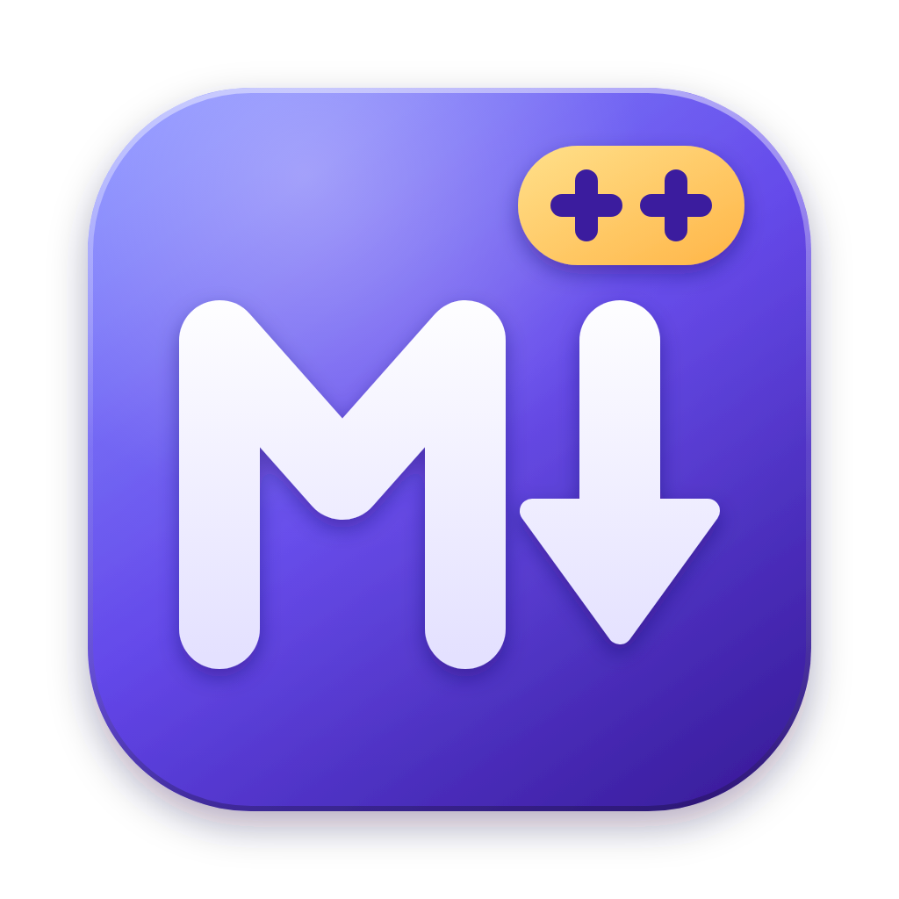
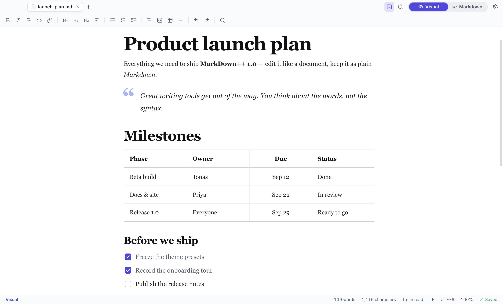
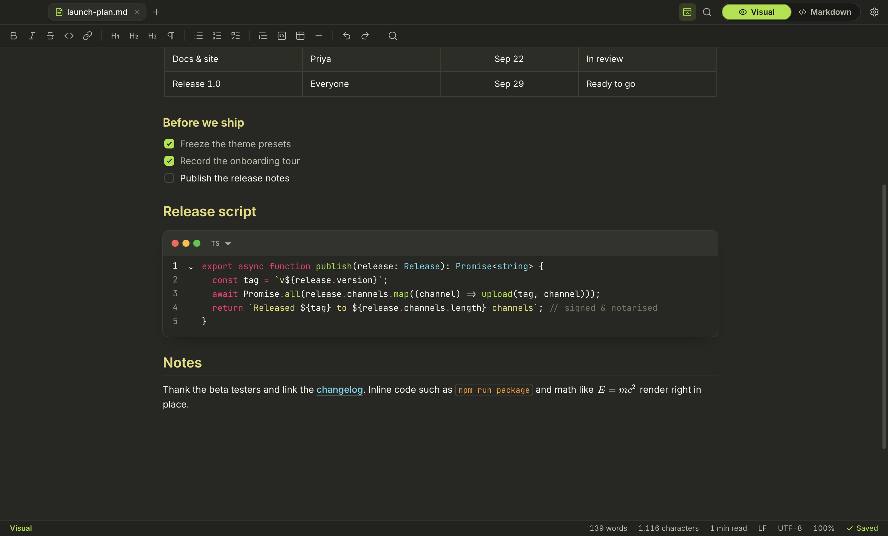
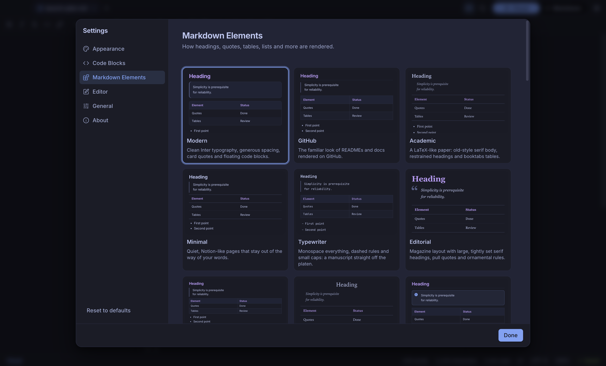

<div align="center">



# MarkDown++

**The Markdown editor that feels like writing, not like coding.**

A fast, modern desktop editor for Markdown files with best-in-class visual (WYSIWYG)
editing — and a single switch that takes you to the raw Markdown source and back.

[](https://github.com/Amadudl/MarkDownPlusPlus/actions/workflows/ci.yml)
[](https://github.com/Amadudl/MarkDownPlusPlus/actions/workflows/codeql.yml)
[](https://github.com/Amadudl/MarkDownPlusPlus/releases/latest)
[](#download-and-installation)
[](LICENSE)

[Download](#download-and-installation) ·
[Tutorial](docs/tutorial.md) ·
[User guide](docs/user-guide.md) ·
[Theming](docs/theming.md) ·
[Shortcuts](docs/keyboard-shortcuts.md) ·
[Contributing](CONTRIBUTING.md)

<br />


</div>

## Why MarkDown++?

Notepad++ made plain-text editing fast and pleasant. MarkDown++ does the same for
Markdown — but you edit the _formatted_ document. Headings look like headings, tables
look like tables and code blocks are highlighted as you type. When you need precise
control, one click (or `⌘E` / `Ctrl+E`) flips the same document into the raw source.
Your files stay plain `.md` files that work everywhere.

## Screenshots

<table>
  <tr>
    <td width="50%"><br /><sub><b>Visual mode</b> — Daylight scheme, Editorial element style</sub></td>
    <td width="50%"><br /><sub><b>Markdown mode</b> — the same document as source, one click away</sub></td>
  </tr>
  <tr>
    <td width="50%"><br /><sub><b>Code themes</b> — Monokai, one of 34 IDE-inspired themes</sub></td>
    <td width="50%"><br /><sub><b>Settings</b> — a gallery of 21 colour schemes</sub></td>
  </tr>
  <tr>
    <td width="50%"><br /><sub><b>Command palette</b> — every command and recent file, fuzzy-searchable</sub></td>
    <td width="50%"><br /><sub><b>Element styles</b> — 11 presets for typography and every element</sub></td>
  </tr>
</table>

## Features

### Visual mode (WYSIWYG)

- **Real WYSIWYG editing** built on [Milkdown](https://milkdown.dev/) / ProseMirror — no
  split-pane preview.
- **Slash menu**: type `/` on an empty line to insert headings, lists, tables, code
  blocks, quotes, math, images and more.
- **Block drag handles** to move any paragraph, list or table.
- **Floating toolbar** on text selection, plus a full formatting toolbar that works in
  both modes.
- **Tables** with row/column editing and alignment, **task lists** with clickable
  checkboxes, **images** (including local images relative to the document), links.
- **Code blocks** with syntax highlighting for 100+ languages and a language picker.
- **Math** (inline `$…$` and display `$$…$$`) rendered with KaTeX.
- Markdown shortcuts as you type: `# `, `- `, `1. `, `> `, ` ``` `, `**bold**`, …
- **YAML front matter** is kept verbatim and shown read-only above the document.

### Markdown mode (source)

- A full [CodeMirror 6](https://codemirror.net/) source editor with Markdown syntax
  highlighting, highlighted fenced code, line numbers, word wrap and spell checking.
- **One-click Visual/Markdown switch** — the document is the same Markdown string in both
  modes, so switching never loses content.

### Everywhere

- **Tabs** for many open documents that shrink, scroll and list themselves in an
  **All open documents** menu when space runs out; drag & drop to open files.
- **Find & replace** in both modes (`⌘F` / `Ctrl+F`, replace with `⌘⌥F` / `Ctrl+H`), with
  case-sensitive, whole-word and regular-expression search; runaway regular expressions
  are refused instead of freezing the window.
- **Outline** sidebar of your headings, **focus mode**, zoom.
- **Command palette** (`⌘⇧P` / `Ctrl+Shift+P`) for every command and recent files.
- **Export** to a self-contained **HTML** page or a **PDF** that looks exactly like the editor.
- **Autosave** (after a delay or when the window loses focus), **session restore** and
  **external change detection** with reload prompts.
- Line endings and UTF-8 byte-order marks are preserved on save; writes are atomic.

### Make it yours

- **21 UI colour schemes** — Midnight, Daylight, Nord, Dracula, One Dark, Solarized,
  Gruvbox, Tokyo Night, Catppuccin, Rosé Pine, GitHub, high-contrast variants and more —
  with automatic light/dark switching that follows your OS.
- **34 code-block themes** styled after classic IDEs and editors: VS Code, Visual Studio,
  IntelliJ Darcula, Xcode, Eclipse, Notepad++, Sublime Mariana, Monokai, Night Owl,
  Cobalt2, Zenburn and more.
- **11 element styles** controlling typography and every rendered element: headings,
  quotes, code blocks, inline code, tables, lists, links, rules and images.
- A **custom theme editor** for all three layers, with JSON **import and export**.

### Secure and portable

- Sandboxed, context-isolated renderer with a strict Content Security Policy; raw HTML
  in documents is never executed.
- The app only reads and writes files **you** gave it (dialogs, file manager, drag & drop,
  recent files, your last session); documents cannot reach any other file.
- **No telemetry**, and remote images are **off by default**, so opening a document can
  never act as a tracking pixel. See [SECURITY.md](SECURITY.md).
- **Installers and portable builds** for macOS, Windows and Linux.

## Download and installation

Download the latest version from the
[**Releases page**](https://github.com/Amadudl/MarkDownPlusPlus/releases/latest).

| Platform              | Installer                                           | Portable (no installation)                           |
| --------------------- | --------------------------------------------------- | ---------------------------------------------------- |
| macOS (Apple silicon) | `MarkDownPlusPlus-<version>-mac-arm64.dmg`          | `MarkDownPlusPlus-<version>-mac-arm64.zip`           |
| macOS (Intel)         | `MarkDownPlusPlus-<version>-mac-x64.dmg`            | `MarkDownPlusPlus-<version>-mac-x64.zip`             |
| Windows (x64 / arm64) | `MarkDownPlusPlus-<version>-win-<arch>-setup.exe`   | `MarkDownPlusPlus-<version>-win-<arch>-portable.exe` |
| Linux (x64)           | `.deb` (Debian, Ubuntu) · `.rpm` (Fedora, openSUSE) | `.AppImage` · `.tar.gz`                              |
| Linux (arm64)         | `.deb`                                              | `.AppImage` · `.tar.gz`                              |

Portable builds can keep all settings in a `MarkDownPlusPlus-data` folder next to the
application. Release builds may not be code-signed yet; see
[docs/installation.md](docs/installation.md) for Gatekeeper and SmartScreen notes,
uninstalling, and building from source.

## Quick start

1. Start MarkDown++. The welcome screen lets you create or open a document or take the
   built-in interactive tour.
2. Press `⌘N` / `Ctrl+N` for a new document and just start typing — try `# ` for a
   heading or `/` for the slash menu.
3. Press `⌘E` / `Ctrl+E`, or use the **Visual | Markdown** switch in the title bar, to see
   the Markdown source. Press it again to return.
4. Save with `⌘S` / `Ctrl+S`.
5. Open **Settings** (`⌘,` / `Ctrl+,`) and pick a colour scheme, a code theme and an
   element style.

The [tutorial](docs/tutorial.md) walks you through your first document step by step, and
the [keyboard shortcuts](docs/keyboard-shortcuts.md) page lists every shortcut for macOS,
Windows and Linux.

## Documentation

| Document                                         | Contents                                                         |
| ------------------------------------------------ | ---------------------------------------------------------------- |
| [Tutorial](docs/tutorial.md)                     | Your first document, step by step.                               |
| [User guide](docs/user-guide.md)                 | The complete manual, including every setting.                    |
| [Installation](docs/installation.md)             | Installers, portable builds, uninstalling, building from source. |
| [Theming](docs/theming.md)                       | UI themes, code themes, element styles, custom theme JSON.       |
| [Keyboard shortcuts](docs/keyboard-shortcuts.md) | All shortcuts for macOS and Windows/Linux.                       |
| [Architecture](docs/architecture.md)             | Processes, IPC contract, editors, theme engine, security.        |
| [Development](docs/development.md)               | Setting up, testing, debugging and packaging.                    |
| [Release process](docs/release.md)               | Versioning, changelog, tagging, signing.                         |

## Development

Requirements: [Node.js](https://nodejs.org/) 22.12 or newer (see `.nvmrc`) and Git.

```bash
git clone https://github.com/Amadudl/MarkDownPlusPlus.git
cd MarkDownPlusPlus
npm ci
npm run dev        # start the app with hot reload
npm run verify     # lint, format check, type-check, unit tests with coverage, E2E tests
```

MarkDown++ is built with Electron, React 19, TypeScript (strict), Milkdown, CodeMirror 6,
zustand and zod. Unit tests run on Vitest with a 95 % coverage threshold; end-to-end tests
drive the real app with Playwright. See [docs/development.md](docs/development.md) for
details and [docs/architecture.md](docs/architecture.md) for how the pieces fit together.

## Contributing

Contributions are welcome! Please read [CONTRIBUTING.md](CONTRIBUTING.md) and our
[Code of Conduct](CODE_OF_CONDUCT.md) first. AI coding agents must follow
[AGENTS.md](AGENTS.md). For questions, see [SUPPORT.md](SUPPORT.md).

## Security

Please do **not** report vulnerabilities in public issues. Use GitHub's private
vulnerability reporting as described in [SECURITY.md](SECURITY.md).

## License

MarkDown++ is **source-available, not open source.** The source code is publicly
visible, but it is not licensed under an OSI-approved license. You may use, study,
modify, and share it for non-commercial purposes. Selling the software or using it
commercially requires prior written permission from Amadeus Lederle.

See [LICENSE](LICENSE) (MarkDownPlusPlus Non-Commercial License 1.0) for the full terms.

Copyright © 2026 Amadeus Lederle.
