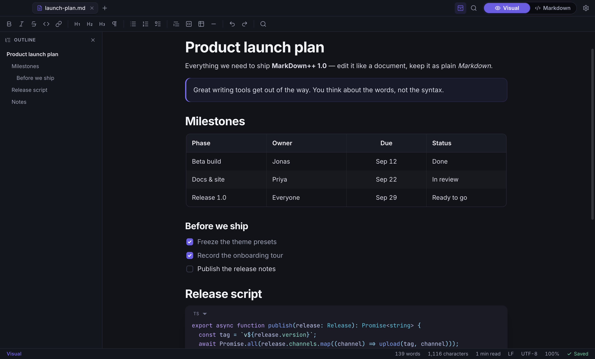
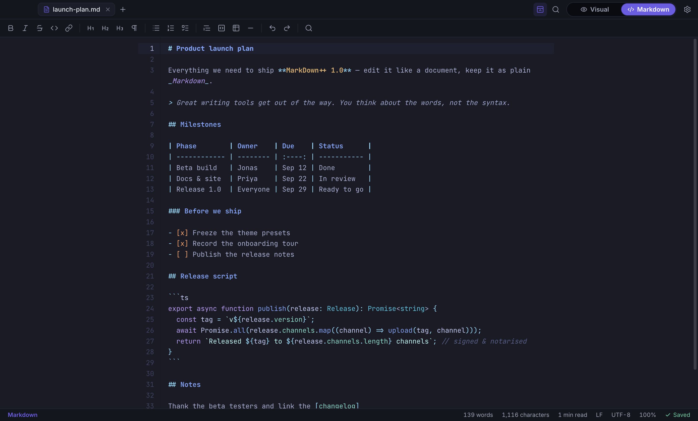
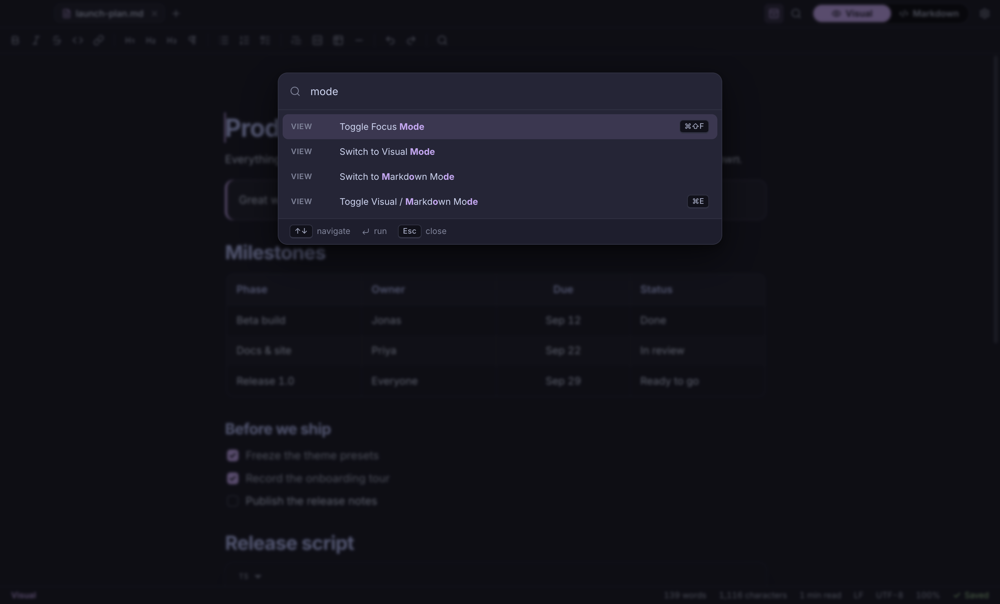
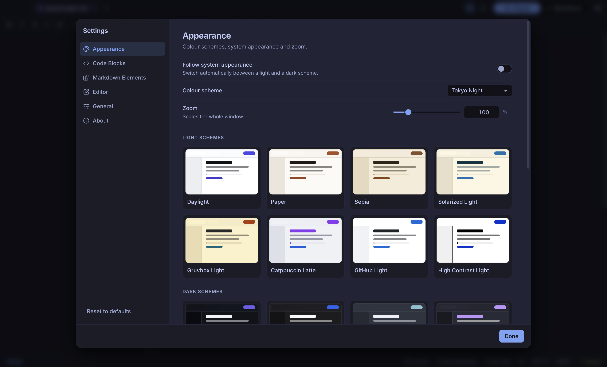

# User guide

This is the complete manual for MarkDown++ 1.0. If you are new, start with the
[tutorial](tutorial.md); come back here when you want the details.

- [Interface tour](#interface-tour)
- [Documents and tabs](#documents-and-tabs)
- [Visual mode and Markdown mode](#visual-mode-and-markdown-mode)
- [Formatting](#formatting)
- [The slash menu](#the-slash-menu)
- [Blocks and the drag handle](#blocks-and-the-drag-handle)
- [Tables](#tables)
- [Code blocks](#code-blocks)
- [Math](#math)
- [Images](#images)
- [Links](#links)
- [Find and replace](#find-and-replace)
- [Outline](#outline)
- [Focus mode and zoom](#focus-mode-and-zoom)
- [Command palette](#command-palette)
- [Export to HTML and PDF](#export-to-html-and-pdf)
- [Saving, autosave and session restore](#saving-autosave-and-session-restore)
- [Files changed by other programs](#files-changed-by-other-programs)
- [Settings reference](#settings-reference)
- [Where settings are stored](#where-settings-are-stored)
- [Troubleshooting](#troubleshooting)
- [Known limitations](#known-limitations)

## Interface tour



```
┌────────────────────────────────────────────────────────────────────────────────────────────┐
│ ● ● ●  notes.md ×  README.md ●  +                        ▭  ⌕  [ Visual | Markdown ]  ⚙    │  ← title bar
├────────────────────────────────────────────────────────────────────────────────────────────┤
│ B I S <> Link │ H1 H2 H3 ¶ │ • 1. ☐ │ ❝ {} ▦ ― │ Undo Redo │ Find                          │  ← formatting toolbar
├──────────────┬─────────────────────────────────────────────────────────────────────────────┤
│ Outline      │                                                                             │
│  Intro       │  # Meeting notes                                                            │  ← editor
│  Decisions   │  The document, formatted as you type…                                       │
│  Next steps  │                                                                             │
├──────────────┴─────────────────────────────────────────────────────────────────────────────┤
│ Markdown  Ln 12, Col 4   1,024 words  6,120 characters  5 min read  LF  UTF-8  100%  Saved │  ← status bar
└────────────────────────────────────────────────────────────────────────────────────────────┘
```

In the title bar, `▭` shows or hides the formatting toolbar (only while a document is
open), `⌕` opens the command palette and `⚙` opens the settings.

| Area            | What it does                                                                                                                                                                                                                                                                                                                                                                                                                                                                                                                                                                                                                                                                                                                |
| --------------- | --------------------------------------------------------------------------------------------------------------------------------------------------------------------------------------------------------------------------------------------------------------------------------------------------------------------------------------------------------------------------------------------------------------------------------------------------------------------------------------------------------------------------------------------------------------------------------------------------------------------------------------------------------------------------------------------------------------------------- |
| **Tab bar**     | One tab per open document. A dot marks unsaved changes. Tabs shrink when space runs out; when they no longer fit, faded edges show that more tabs are hidden, the mouse wheel scrolls the tab bar, and the **All open documents** button next to the tabs lists every tab. The active tab always stays in view.                                                                                                                                                                                                                                                                                                                                                                                                             |
| **Mode switch** | Switches the active document between **Visual mode (WYSIWYG)** and **Markdown mode (source)**.                                                                                                                                                                                                                                                                                                                                                                                                                                                                                                                                                                                                                              |
| **Toolbar**     | Formatting commands that work in both modes, plus Undo, Redo and Find (open the replace row from the find bar, or use **Find and Replace**). Hover a button to see its shortcut; hide or show the toolbar with the toolbar button in the title bar (next to the command palette button).                                                                                                                                                                                                                                                                                                                                                                                                                                    |
| **Outline**     | Optional sidebar with the headings of the document.                                                                                                                                                                                                                                                                                                                                                                                                                                                                                                                                                                                                                                                                         |
| **Editor**      | The document itself.                                                                                                                                                                                                                                                                                                                                                                                                                                                                                                                                                                                                                                                                                                        |
| **Status bar**  | From left to right: the mode (click to switch); in Markdown mode the cursor position (_Ln x, Col y_), followed by the selection size (_(n characters selected)_) while text is selected; in Visual mode only the selection size (_n characters selected_), and nothing while no text is selected; the word count; the character count (hover it for the count without spaces and the number of lines); the reading time (_n min read_); the line ending (click to switch LF / CRLF); the encoding (_UTF-8_, or _UTF-8 BOM_ when the file has a byte-order mark); the zoom level (click to reset it to 100 %); and the save state (_Saved_, _Unsaved_ or _Not saved yet_ for a new document). Can be hidden in the settings. |

Every action is also available from the native **application menu** and the
[command palette](#command-palette).

## Documents and tabs

| Task                      | How                                                                                                               |
| ------------------------- | ----------------------------------------------------------------------------------------------------------------- |
| New document              | **File → New**, `⌘N` / `Ctrl+N`, or double-click the empty area of the tab bar.                                   |
| Open files                | **File → Open…** (`⌘O` / `Ctrl+O`), drag & drop `.md` files onto the window, or open them from your file manager. |
| Recent files              | **File → Open Recent** or the command palette. **File → Open Recent → Clear Recent** empties the list.            |
| Save / Save As / Save All | `⌘S` / `Ctrl+S`, `⌘⇧S` / `Ctrl+Shift+S`, `⌘⌥S` / `Ctrl+Alt+S`.                                                    |
| Close tab                 | `⌘W` / `Ctrl+W`, the × on the tab, or middle-click the tab.                                                       |
| Switch tabs               | Click a tab, `⌃Tab` / `Ctrl+Tab` (next), `⌃⇧Tab` / `Ctrl+Shift+Tab` (previous).                                   |
| Reorder tabs              | Drag a tab to a new position.                                                                                     |
| Reveal file               | **File → Reveal in Finder** (macOS) / **Reveal in Folder**, or the palette's **Reveal in File Manager**.          |

MarkDown++ opens Markdown and text files with the extensions `.md`, `.markdown`, `.mdown`,
`.mkd`, `.mkdn`, `.mdwn`, `.mdx` and `.txt`. The **Open** dialog offers a _Markdown_ filter,
a _Text_ filter (`.txt`) and an _All Files_ filter, so you can also open other plain-text
files through it. Files larger than **50 MB**, binary files (files containing NUL bytes)
and text that is not UTF-8 (for example UTF-16) are refused with an error message, so saving
can never corrupt them. Only `.md`, `.markdown`, `.mdown`, `.mkd` and `.mkdn`
are registered with the operating system, so only these open in MarkDown++ when you
double-click them in your file manager. Opening a file that is already open simply
activates its tab.

When you close a tab or quit with unsaved changes, MarkDown++ asks whether to **Save**,
**Don't Save** or **Cancel** (unless you disabled _Confirm before closing unsaved documents_).
Closing the window or quitting asks about every unsaved document in turn; **Cancel** keeps
the window open (and, on macOS, cancels the quit). If the window stops responding while
it closes, MarkDown++ closes it anyway after a few seconds.

**Which files MarkDown++ reads and writes.** For your safety, MarkDown++ only reads,
saves, watches or reveals files that you gave it yourself: files picked in the **Open** or
**Save As** dialog, files opened from your file manager or the command line, Markdown and
text files dropped onto the window, entries of the recent files list and the documents of
your last session. A document cannot make the app read or change any other file (images
are the only exception, see [Images](#images)).

**Files are handled carefully:**

- The line ending of every file (LF or CRLF) and a UTF-8 byte-order mark (BOM) are
  detected on open and preserved on save. New documents use the line ending chosen in
  the settings.
- Saving is **atomic**: MarkDown++ writes to a temporary file and then replaces the
  original, so a crash or full disk never leaves a half-written document. When
  replacing the file would change it in other ways — it has hard links or belongs to
  another user, its folder does not let you create files, or (on Windows) another
  program keeps it locked after a few retries — the file is overwritten in place
  instead, which keeps its owner, links and permissions.
- A **write-protected** file (read-only permissions or the Windows _Read-only_
  attribute) is never overwritten: saving shows an error, and **Save As** saves a copy.
- **Save As** and **Export** start in the folder of the current document (or in your
  Documents folder for a new one).
- The recent files list hides files that cannot be found right now (for example on an
  unplugged drive or an offline network share) but keeps them, so they return when the
  drive is back. Opening and saving never fail because the list itself cannot be saved.

## Visual mode and Markdown mode

MarkDown++ has two ways of editing the same document:

| Mode                       | What you see                                                                                 | Best for                                          |
| -------------------------- | -------------------------------------------------------------------------------------------- | ------------------------------------------------- |
| **Visual mode (WYSIWYG)**  | The formatted document — headings, tables, images, highlighted code and math, rendered live. | Writing, reading, restructuring.                  |
| **Markdown mode (source)** | The raw Markdown text with syntax highlighting, line numbers and highlighted fenced code.    | Precise edits, front matter, bulk find & replace. |



Switch with the **Visual | Markdown** switch in the title bar, **View → Toggle Visual /
Markdown Mode**, or `⌘E` / `Ctrl+E`. Each tab remembers its own mode, and new documents
open in the _Default mode_ from the settings.

### How switching preserves your content

The Markdown text is the **single source of truth**. When you switch, MarkDown++ takes
the current Markdown from the active editor and loads exactly that text into the other
one. Nothing is kept in a hidden format, so switching back and forth never loses content,
and undo history within each mode stays intact until you switch.

**Visual mode normalises some Markdown syntax when you edit in it.** The Visual editor
works on a document tree and writes Markdown back out in one consistent style, so a
document edited in Visual mode may differ _textually_ (never in content) from the
original. Typical normalisations:

- bullet markers become one consistent marker (e.g. `*` and `+` become `-`);
- emphasis and strong markers become one consistent style (e.g. `__bold__` becomes `**bold**`);
- table delimiter rows are rewritten (column padding, alignment colons such as `:---:`);
- numbered lists may be renumbered, and blank lines between blocks are normalised;
- escaping of special characters may change.

Undoing an edit by hand (typing a character and deleting it again) restores the file's
original text, so the document is not marked as changed.

**YAML front matter** (a `---` … `---` block at the very top, as used by Jekyll, Hugo or
Obsidian) is kept exactly as written. Visual mode shows it read-only in a _Front matter_
panel above the document; edit it in Markdown mode.

If the exact bytes of a file matter (for example a hand-formatted table or a file
checked by a linter), edit it in **Markdown mode**, which never reformats anything.

## Formatting

The toolbar, the **Format** menu, the command palette and keyboard shortcuts offer the
same formatting commands in both modes. In Visual mode they format the selection
directly; in Markdown mode they insert or toggle the corresponding Markdown syntax.

| Command         | macOS     | Windows / Linux   | Markdown      |
| --------------- | --------- | ----------------- | ------------- |
| Bold            | `⌘B`      | `Ctrl+B`          | `**text**`    |
| Italic          | `⌘I`      | `Ctrl+I`          | `*text*`      |
| Strikethrough   | `⌘⇧X`     | `Ctrl+Shift+X`    | `~~text~~`    |
| Inline code     | `` ⌃` ``  | `` Ctrl+` ``      | `` `code` ``  |
| Link            | `⌘K`      | `Ctrl+K`          | `[text](url)` |
| Heading 1 – 3   | `⌘1`–`⌘3` | `Ctrl+1`–`Ctrl+3` | `#` … `###`   |
| Paragraph       | `⌘⌥0`     | `Ctrl+Alt+0`      | plain text    |
| Bulleted list   | `⌘⇧8`     | `Ctrl+Shift+8`    | `- item`      |
| Numbered list   | `⌘⇧7`     | `Ctrl+Shift+7`    | `1. item`     |
| Task list       | `⌘⇧9`     | `Ctrl+Shift+9`    | `- [ ] item`  |
| Quote           | `⌘⇧B`     | `Ctrl+Shift+B`    | `> text`      |
| Code block      | `⌘⌥C`     | `Ctrl+Alt+C`      | ` ``` `       |
| Table           | `⌘⌥T`     | `Ctrl+Alt+T`      | GFM table     |
| Horizontal rule | —         | —                 | `---`         |

**Markdown shortcuts in Visual mode.** You can type Markdown syntax and it turns into
formatting as you go: `# ` to `###### ` for headings, `- ` or `* ` for a bulleted list,
`1. ` for a numbered list, `- [ ] ` for a task (or `[ ] ` at the start of an existing list item), `> ` for a quote, ` ``` ` for a code block,
`---` for a rule, and `**bold**`, `*italic*`, `~~strike~~`, `` `code` `` inline.

When you select text in Visual mode, a **floating toolbar** appears next to the
selection with the most common inline formats.

## The slash menu

In Visual mode, type `/` at the start of an empty line to open the **slash menu**. Keep
typing to filter (`/table`, `/code`, `/quote`, `/task`, `/math`, `/image`), move with the
arrow keys and press `Enter` to insert the block. `Esc` closes the menu and keeps the `/`.

The menu offers text blocks (paragraph, headings 1 – 6, quote, divider), lists
(bulleted, numbered, task list), and advanced blocks (code block, table, math block,
image).

## Blocks and the drag handle

Hover over a block in Visual mode and a **handle** appears to its left. Content inside a
table or a quote has no handle of its own; use the handle of the whole table or quote.

- **Drag** the handle to move the block (paragraph, list, table, code block, …) to a new position.
- **Click** the plus next to it to insert a new block below with the slash menu.

## Tables

Insert a table with the slash menu (`/table`), the toolbar, **Format → Table** or
`⌘⌥T` / `Ctrl+Alt+T`. In Visual mode:

- click into a cell and press `Tab` / `Shift+Tab` to move between cells;
- use the handles at the top of a column and the left of a row to select it and to add,
  delete or move rows and columns;
- set the alignment of a column (left, centre, right) from the column menu.

Tables are saved as [GitHub Flavored Markdown](https://github.github.com/gfm/#tables-extension-)
tables. Visual mode rewrites the delimiter row and cell padding when you edit a table
(see [normalisation](#how-switching-preserves-your-content)).

## Code blocks

Insert a code block with ` ``` ` + `Enter`, the slash menu (`/code`), the toolbar or
`⌘⌥C` / `Ctrl+Alt+C`. Code is highlighted for more than 100 languages. In Visual mode,
choose the language with the picker in the top corner of the block; in Markdown mode,
write it after the opening fence:

````markdown
```python
print("Hello, MarkDown++")
```
````

The colours come from the active **code theme** and the look of the block (flat,
bordered, shadow or window frame, radius, language label, line numbers) from the active
**element style**. See [theming](theming.md).

## Math

Math is rendered with [KaTeX](https://katex.org/):

- inline math between single dollar signs: `$E = mc^2$`;
- display math between double dollar signs on their own lines:

```markdown
$$
\int_{-\infty}^{\infty} e^{-x^2}\,dx = \sqrt{\pi}
$$
```

In Visual mode, insert a math block with `/math` and click a formula to edit its source.
Formulas cannot draw boxes larger than 50 em or expand macros endlessly, so a document
cannot freeze the editor with oversized math.

## Images

Use `` or `/image` in Visual mode.

- **Local images** can be absolute paths or paths **relative to the document**, for
  example ``. Relative paths only work once the document
  has been saved, because they are resolved against its folder.
- **Remote images** (`https://…`) are shown only when _Load remote images_ is enabled
  (**off by default**). While it is off they are shown as an _Image blocked_
  placeholder and never requested, because loading a remote image tells its server when
  and from where you opened the document (tracking pixels in mailed or downloaded files).
  Enable it in **Settings → General** if you trust your documents.
- `data:` image URLs are supported.

For security, the editor can only load files with image extensions (such as `.png`,
`.jpg`, `.gif`, `.webp`, `.svg`) from your disk; other files referenced from a document
are never read. A document can display any image file on your local disks, not only
images next to it. On Windows, images on a network share are only loaded from a server
that hosts a file you opened.

## Links

Insert a link with `⌘K` / `Ctrl+K` or type `[text](https://example.com)`. Links are
edited in place in both modes and stay regular Markdown links in the file. Whenever
MarkDown++ itself opens a link (for example from **Help → Documentation** or the About
page), it hands it to your default browser — and only for `https:`, `http:` and `mailto:`
URLs; other schemes are ignored for your safety. `mailto:` links only pass on the
recipients and the `to`, `cc`, `bcc`, `subject` and `body` fields, so a link in a document
cannot make your mail client attach a file (`attach=`). The app window never navigates
away from your document.

## Find and replace

Open the find bar with `⌘F` / `Ctrl+F`, or find and replace with `⌘⌥F` / `Ctrl+H`
(**Edit → Replace…**). On macOS `⌘H` is reserved for _Hide MarkDown++_, so Find and
Replace uses `⌘⌥F` there. You can also open the replace row from the find bar with its
_Show replace_ toggle. The find bar works in both modes and offers:

- **Match case**, **Whole word** and **Regular expression** toggles;
- highlighting of all matches in the document (the current match is emphasised);
- a live match counter (e.g. _3 of 12_) that follows your edits while the bar is open, and
  an error hint for an invalid regular expression;
- **Next** / **Previous** (`Enter` / `Shift+Enter`), **Replace** and **Replace all**.

In Visual mode, search matches the visible text; in Markdown mode it also matches
Markdown syntax (for example `**`). Press `Esc` to close the find bar; this removes the
highlights in every tab.

Regular expressions that could freeze the editor are refused with a hint instead of
being run: patterns with nested repetition such as `(a+)+`, and patterns that take too
long on the current document (they are tried in the background first). Rewrite them
without the nested repetition, e.g. `a+` instead of `(a+)+`.

## Outline

**View → Outline** (`⌘⇧O` / `Ctrl+Shift+O`) shows a sidebar with all headings of
the active document. Click a heading to scroll to it. The outline updates as you type.
It lists top-level headings only: headings inside lists, block quotes, HTML blocks and
code blocks are not part of the outline.
Whether the outline is shown is remembered across restarts (`general.showOutline`).

## Focus mode and zoom

- **Focus mode** (`⌘⇧F` / `Ctrl+Shift+F`) hides the tab bar, toolbar, outline and status
  bar so that only your text remains. Use the same shortcut or the command palette to leave it.
- **Zoom** the whole window with `⌘=` / `Ctrl+=`, `⌘-` / `Ctrl+-` and reset with
  `⌘0` / `Ctrl+0` (10 % steps, 50 % – 300 %). The zoom level is remembered.

## Command palette

Press `⌘⇧P` / `Ctrl+Shift+P` to open the command palette. It lists every command with its
shortcut and your recent files. Type to fuzzy-search (e.g. `exp pdf` finds _Export as
PDF…_), use the arrow keys to select and `Enter` to run.



## Export to HTML and PDF

**File → Export as HTML…** and **File → Export as PDF…** (`⌘⇧E` / `Ctrl+Shift+E`) export
the active document with the active themes, so the result looks like the editor.

- **HTML** export creates a single, self-contained `.html` file with the styles, syntax
  highlighting and KaTeX math embedded. The HTML is sanitised: scripts, event handlers
  and other active content from the document are removed.
- **PDF** export renders the same HTML in a hidden window with JavaScript disabled and
  prints it to PDF.
  Remote images get up to 10 seconds to load; images that have not arrived by then
  (for example from an unreachable server) are left out instead of failing the export.

Local images are embedded so the export also works on other computers.

## Saving, autosave and session restore

- **Autosave** (off by default) can save documents _after a delay_ (when you stop typing
  for the configured time) or _on focus change_ (when the MarkDown++ window loses focus).
  Autosave only applies to documents that already have a file name, and never overwrites
  a file that was changed by another program.
- **Session restore** (on by default) reopens the tabs of your last session, each in the
  mode it was in, and activates the tab that was active. The session is saved while you
  work — right after you open, close or switch a tab or change its mode — so it also
  survives a crash, a force quit or an OS restart. Unsaved new documents are not part of
  the session; MarkDown++ asks you about them when you quit.

## Files changed by other programs

MarkDown++ watches every open file.

- If a file changes on disk and the tab has **no unsaved changes**, it is reloaded
  automatically and a short notification is shown.
- If the tab **has unsaved changes**, a banner offers **Reload from disk** (discarding
  your changes) or **Keep mine**. Autosave pauses for that document until you decide.
- If a file is **deleted or moved**, a banner offers **Keep as unsaved** (the tab keeps
  your content; saving writes the file again) or **Close**.

## Settings reference

Open **Settings** with `⌘,` / `Ctrl+,` or the gear button in the title bar. Changes apply
immediately and are saved automatically. The dialog has the sections **Appearance**,
**Code Blocks**, **Markdown Elements**, **Editor**, **General** and **About**. The tables
list every setting with its label, its key in `settings.json` and its default.

### Appearance

| Label                    | Key                         | Values / default                 | Description                                                                                                               |
| ------------------------ | --------------------------- | -------------------------------- | ------------------------------------------------------------------------------------------------------------------------- |
| Follow system appearance | `appearance.followSystem`   | `true` / `false`, default `true` | Switch automatically between the light and the dark scheme when the OS changes.                                           |
| Light scheme             | `appearance.lightTheme`     | theme id, default `daylight`     | Used while the OS is in light mode (with _Follow system appearance_).                                                     |
| Dark scheme              | `appearance.darkTheme`      | theme id, default `midnight`     | Used while the OS is in dark mode (with _Follow system appearance_).                                                      |
| Colour scheme            | `appearance.uiTheme`        | theme id, default `midnight`     | The scheme used when _Follow system appearance_ is off.                                                                   |
| Zoom                     | `appearance.zoom`           | `0.5` – `3`, default `1`         | Scales the whole window.                                                                                                  |
| _Customize_              | `appearance.customUiThemes` | list (max. 100), default empty   | Your own schemes: **Duplicate**, edit every colour, **Export JSON**, **Import JSON…**, delete. See [theming](theming.md). |

With _Follow system appearance_ on, the gallery for the current system appearance comes
first, and badges mark the schemes _Used in light mode_ and _Used in dark mode_. Picking a
scheme for the other appearance (for example a light scheme while your system is dark)
sets it as the scheme for that appearance; a notice explains when it will be used and
offers **Use it now**, which turns _Follow system appearance_ off and applies the scheme
right away.



### Code Blocks

| Label                    | Key                          | Values / default                   | Description                                                                                                      |
| ------------------------ | ---------------------------- | ---------------------------------- | ---------------------------------------------------------------------------------------------------------------- |
| Auto (match UI theme)    | `rendering.codeTheme`        | theme id or `auto`, default `auto` | Syntax colours of code blocks and of Markdown mode. `auto` picks the code theme paired with the active UI theme. |
| Dark / Light code themes | `rendering.codeTheme`        | theme id                           | Pick any built-in or custom code theme.                                                                          |
| _Customize_              | `rendering.customCodeThemes` | list (max. 100), default empty     | Your own code themes, including _Italic comments_ and _Bold keywords_.                                           |

### Markdown Elements

| Label         | Key                             | Values / default               | Description                                                                                                                                     |
| ------------- | ------------------------------- | ------------------------------ | ----------------------------------------------------------------------------------------------------------------------------------------------- |
| Presets       | `rendering.elementStyle`        | style id, default `modern`     | Typography and the look of headings, quotes, code blocks, inline code, tables, lists, links, rules and images. A live preview shows the result. |
| _Fine tuning_ | `rendering.customElementStyles` | list (max. 100), default empty | Adjust any property; your first edit of a built-in preset creates a custom copy. See [theming](theming.md#element-style).                       |

### Editor

| Label                     | Key                        | Values / default                                                             | Description                                                                                                |
| ------------------------- | -------------------------- | ---------------------------------------------------------------------------- | ---------------------------------------------------------------------------------------------------------- |
| Default mode              | `editor.defaultMode`       | `wysiwyg` (Visual) / `source` (Markdown), default `wysiwyg`                  | The mode new and opened documents start in.                                                                |
| Source font               | `editor.sourceFontFamily`  | Curated list (default _JetBrains Mono (bundled)_) or _Custom…_ CSS font list | Font of Markdown mode, previewed by a sample line.                                                         |
| Source font size          | `editor.sourceFontSize`    | `8` – `40` px, default `14`                                                  | Font size of Markdown mode.                                                                                |
| Line numbers              | `editor.sourceLineNumbers` | `true` / `false`, default `true`                                             | Show line numbers in Markdown mode.                                                                        |
| Word wrap                 | `editor.wordWrap`          | `true` / `false`, default `true`                                             | Wrap long lines in Markdown mode; wrapped text uses the same column width as Visual mode.                  |
| Spell checking            | `editor.spellcheck`        | `true` / `false`, default `true`                                             | Use the operating system's spell checker.                                                                  |
| Tab size                  | `editor.tabSize`           | `1` – `8`, default `2`                                                       | Width of a tab and of one indentation step.                                                                |
| Auto save                 | `editor.autoSave`          | `off` / `afterDelay` / `onFocusChange`, default `off`                        | See [autosave](#saving-autosave-and-session-restore).                                                      |
| Auto save delay           | `editor.autoSaveDelayMs`   | `500` – `60000` ms, default `1500`                                           | Idle time before _after delay_ auto save saves.                                                            |
| Restore session           | `editor.restoreSession`    | `true` / `false`, default `true`                                             | Reopen the previous session's documents on start.                                                          |
| Line endings of new files | `editor.newLineEnding`     | `lf` / `crlf` / `system`, default `system`                                   | Line ending of new documents; existing files keep theirs. `system` means CRLF on Windows and LF elsewhere. |

### General

| Label                                    | Key                          | Values / default                  | Description                                                                                                                              |
| ---------------------------------------- | ---------------------------- | --------------------------------- | ---------------------------------------------------------------------------------------------------------------------------------------- |
| Confirm before closing unsaved documents | `general.confirmOnClose`     | `true` / `false`, default `true`  | Ask before discarding unsaved changes.                                                                                                   |
| Show welcome screen                      | `general.showWelcome`        | `true` / `false`, default `true`  | Show the welcome screen (new, open, tutorial, recent files) at startup when no document is open; otherwise start with an empty document. |
| Show status bar                          | `general.showStatusBar`      | `true` / `false`, default `true`  | Show the status bar.                                                                                                                     |
| Load remote images                       | `rendering.loadRemoteImages` | `true` / `false`, default `false` | Allow images from `https://` addresses (off by default for privacy). Local images always load.                                           |
| — (View → Outline)                       | `general.showOutline`        | `true` / `false`, default `false` | Whether the outline sidebar is shown; remembered when you toggle it.                                                                     |

The settings file is validated on load. If it is damaged, invalid sections fall back to
their defaults instead of preventing MarkDown++ from starting. **Reset to defaults** at the
bottom of the Settings sidebar restores all defaults (custom themes included).

## Where settings are stored

| OS              | Location                                                                                                                              |
| --------------- | ------------------------------------------------------------------------------------------------------------------------------------- |
| macOS           | `~/Library/Application Support/MarkDown++/settings.json`                                                                              |
| Windows         | `%APPDATA%\MarkDown++\settings.json`                                                                                                  |
| Linux           | `~/.config/MarkDown++/settings.json` (or `$XDG_CONFIG_HOME/MarkDown++/`)                                                              |
| Portable builds | `MarkDownPlusPlus-data/settings.json` next to the application (see [installation](installation.md#portable-mode-and-the-data-folder)) |

The same folder holds `recent-files.json`, `session.json` and `window-state.json`; see
[installation](installation.md#where-settings-are-stored).

## Troubleshooting

| Problem                                               | Solution                                                                                                                             |
| ----------------------------------------------------- | ------------------------------------------------------------------------------------------------------------------------------------ |
| A local image is not shown                            | Save the document first (relative paths are resolved against its folder) and check that the file has an image extension.             |
| Remote images are not shown                           | Enable _Load remote images_ in the settings.                                                                                         |
| The file looks different after editing in Visual mode | Visual mode normalises Markdown syntax; use Markdown mode for byte-exact edits (see [above](#how-switching-preserves-your-content)). |
| macOS says the app cannot be opened                   | See [Gatekeeper](installation.md#first-launch-gatekeeper).                                                                           |
| Windows SmartScreen blocks the app                    | See [SmartScreen](installation.md#first-launch-smartscreen).                                                                         |
| Settings seem broken                                  | Use **Reset to defaults** in the Settings dialog, or quit MarkDown++ and delete `settings.json`.                                     |

Still stuck? See [SUPPORT.md](../SUPPORT.md).

## Known limitations

- **Visual mode normalises some Markdown syntax on edit.** When you edit a document in
  Visual mode, it is written back in one consistent style (list markers, emphasis
  markers, table padding, numbering, escaping), so the file may change textually even
  though its content does not. Use Markdown mode when the exact bytes matter (see
  [How switching preserves your content](#how-switching-preserves-your-content)).
- **Atomic saves do not preserve macOS extended attributes.** Saving writes a new file
  and replaces the original, so extended attributes such as **Finder tags**, comments or
  the quarantine flag are not carried over to the saved file. (Files with hard links or
  another owner are overwritten in place and keep them.)
- **A pathological regular expression can still be slow.** Find refuses patterns with
  nested repetition such as `(a+)+` and patterns that are too slow on the current
  document, but other patterns with heavy backtracking can still make searching a large
  document noticeably slow. Prefer simple patterns or turn off _Regular expression_.
- **Unsigned builds trigger Gatekeeper and SmartScreen.** Release builds are not signed
  with paid certificates, so macOS Gatekeeper and Windows SmartScreen warn on first start
  (downloads can be [verified](installation.md#unsigned-builds-and-verifying-a-download)
  instead). See
  [Gatekeeper](installation.md#first-launch-gatekeeper) and
  [SmartScreen](installation.md#first-launch-smartscreen) for how to open the app.
